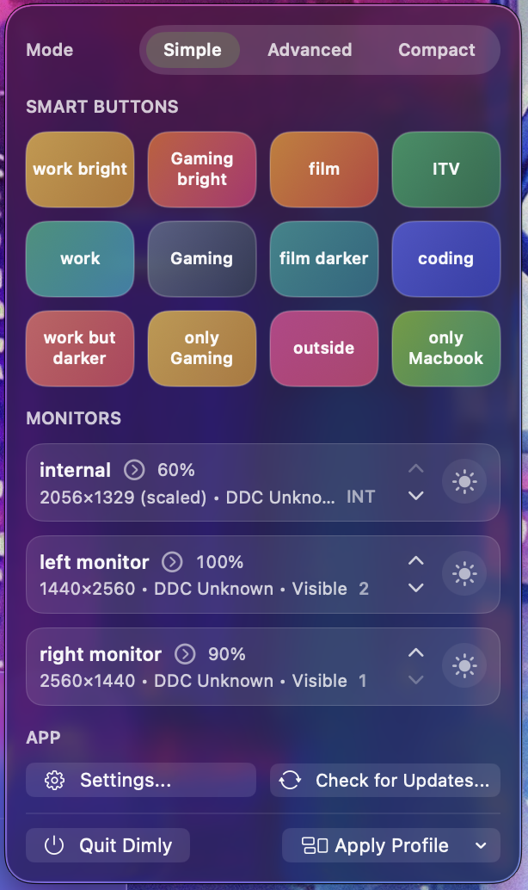

# Dimly

Dimly is a free, open-source macOS menu bar control center for multi-monitor setups. It gives you per-display brightness and reliable per-display on/off behavior, using true DDC control when available and overlay fallback when it is not, so mixed monitor fleets behave like one coherent setup.

  
  

    

  

  

    
🌍 Localizations (40)

    
<strong>Europe</strong>: 🇪🇸 Español · 🇮🇹 Italiano · 🇩🇪 Deutsch · 🇫🇷 Français · 🇵🇹 Português · 🇺🇦 Українська · 🇷🇺 Русский · 🇵🇱 Polski · 🇬🇷 Ελληνικά · 🇳🇱 Nederlands · 🇸🇪 Svenska · 🇨🇿 Čeština · 🇭🇺 Magyar · 🇫🇮 Suomi · 🇮🇪 Gaeilge · 🇦🇩 Català.

    
<strong>Asia</strong>: 🇵🇭 Filipino · 🇮🇳 हिन्दी · 🇮🇩 Bahasa Indonesia · 🇻🇳 Tiếng Việt · 🇹🇷 Türkçe · 🇨🇳 中文 · 🇯🇵 日本語 · 🇰🇷 한국어 · 🇹🇭 ภาษาไทย · 🇸🇦 العربية · 🇧🇩 বাংলা · 🇮🇷 فارسی · 🇲🇾 Bahasa Melayu · 🇲🇲 မြန်မာ · 🇮🇳 தமிழ் · 🇮🇳 తెలుగు · 🇵🇰 اردو.

    
<strong>Africa</strong>: 🇪🇹 አማርኛ · 🇳🇬 Hausa · 🇰🇪 Kiswahili · 🇳🇬 Yorùbá.

    
<strong>Americas</strong>: 🇧🇷 Português (Brasil) · 🇲🇽 Español (LatAm) · 🇺🇸 English.

  

## Big hits

- **True per-display control** - Brightness, blackout, sleep, wake, rename, and copy ID per monitor from one menu.
- **DDC first, overlay fallback** - Hardware brightness and sleep/wake when possible; smooth fallback when DDC is unavailable.
- **Instant blackout + safe recovery** - Fast glare kill plus fixed panic hotkey to restore all displays.
- **Profiles + smart buttons** - Save monitor states, reorder profiles, and pin up to 4 smart profile buttons per row.
- **Profile automation** - Auto-apply a selected profile when external displays connect.
- **Targeted shortcuts** - Global hotkeys for all externals or specific displays.
- **Visibility controls** - Show display numbers, merge internal/external ordering, and hide selected monitors from the menu list.
- **Flexible interface** - Simple/advanced mode, appearance options (system/light/dark), and optional colorless smart buttons.
- **Backup and restore** - Import/export general settings and monitor settings independently.
- **Stealth mode** - Hide Dock and menu bar icon while keeping hotkeys active.
- **Universal + updates** - Intel/Apple Silicon builds with Sparkle updates through GitHub.

  
   
  Screenshot: Simple mode

## What it actually does

- **Display inventory + tracking** - live monitor list, reconnect handling, and stable per-display identity.
- **Brightness pipeline** - DDC brightness where supported, overlay brightness where not.
- **Power controls** - DDC standby/wake with immediate blackout fallback when unsupported.
- **State persistence** - blackout and profile state survives monitor reconnects.
- **Hotkey system** - fixed panic hotkey plus customizable targeted bindings.
- **Profiles workflow** - save, apply, rename, reorder, and optional smart-button surfacing in Quick Actions.
- **Automation** - optional profile auto-apply when external monitors connect.
- **Settings backup** - selective import/export for general app settings and monitor-specific settings.
- **Diagnostics** - copy display report and open local diagnostics log quickly.
- **App behavior controls** - launch at login, hide Dock icon, hide menu icon, and keep running for shortcuts.

## How it works

1. Dimly sits in your menu bar. Click it or hit your hotkey.
2. Open a display tile and set **Brightness** per display.
3. If the monitor supports DDC/CI, Dimly uses true hardware brightness and standby/wake.
4. If it does not support DDC/CI, Dimly automatically uses **Overlay mode** for brightness and blackout fallback for on/off behavior.
5. Dimly tracks display changes, keeps state consistent, and can show numbered overlays for quick identification.

## Why this exists

I’ve worked on desks with 8-12 mixed monitors and uneven DDC support, where fast control matters more than perfect hardware. Dimly is built so every screen stays controllable in one clean flow.

## Keyboard & mouse

- **Show/hide Dimly menu popup:** default `Cmd` + `Ctrl` + `Option` + `M` (falls back to normal application window when menu bar icon is hidden).
- **Set your own hotkeys:** assign bindings for blackout, sleep/wake, or menu toggle for all externals or specific displays.
- **Option-click icon:** toggle blackout overlay on all externals.
- **Control-click icon:** toggle sleep/wake (with blackout fallback).
- **Restore everything:** fixed panic hotkey `Ctrl` + `Option` + `Shift` + `P`.
- **Per-display actions:** brightness, sleep, wake, blackout, rename, and copy IDs from each display row.
- **Close quickly:** press Esc or click away; the menu bar extra behaves like built-in menus.

## Quick tips

- Turn on **Show Display Numbers** when rearranging or labeling screens.
- Rename displays once so menus show friendly names instead of model strings.
- Use per-display **Brightness** first, then sleep/wake only when you actually want displays off.
- In mixed monitor setups, expect a blend of DDC and overlay mode; this is exactly what Dimly is designed for.
- If DDC/CI is supported, prefer **Sleep** for true power-off; otherwise blackout remains instant and reliable.
- Use **Profiles** + **Show as smart button** to pin your most-used monitor setups into Quick Actions.
- Use **Settings backup** before major changes so you can import just general or monitor settings later.
- Hide the menu bar icon if you want a stealth setup; hotkeys keep working.
- Use **Copy Display Report** or **Open Diagnostics Log** for fast support/debugging.

## Updates, signing, and safety

- Updates are delivered via Sparkle with ed25519 signatures; the feed lives in `Resources/Info.plist`.
- If signature verification fails, Dimly offers a GitHub download fallback.
- Notarization and hardened runtime are part of the release scripts; binaries ship notarized.
- No telemetry, no background daemons; Dimly runs only in the menu bar or at login.

## Get Dimly

- <a href="https://github.com/Punshnut/macos-dimly/releases/latest">Download the latest release</a> and run it from `/Applications`.
- To auto-start, enable “Launch at Login” in Settings.

Supports Intel and Apple Silicon Macs. Requires macOS 14+

## Roadmap

- **Adaptive dimming** - remember per-location or time-of-day preferences.
- **Profile actions** - apply brightness + blackout/sleep rules when a saved setup is selected.
- **Per-app triggers** - auto-dim when select apps enter full screen.
- **Script hooks** - call custom scripts before/after blackout.

[Donate (Ko-Fi)](https://ko-fi.com/janfeuerbacher)

Made with ❤️

## Star History

