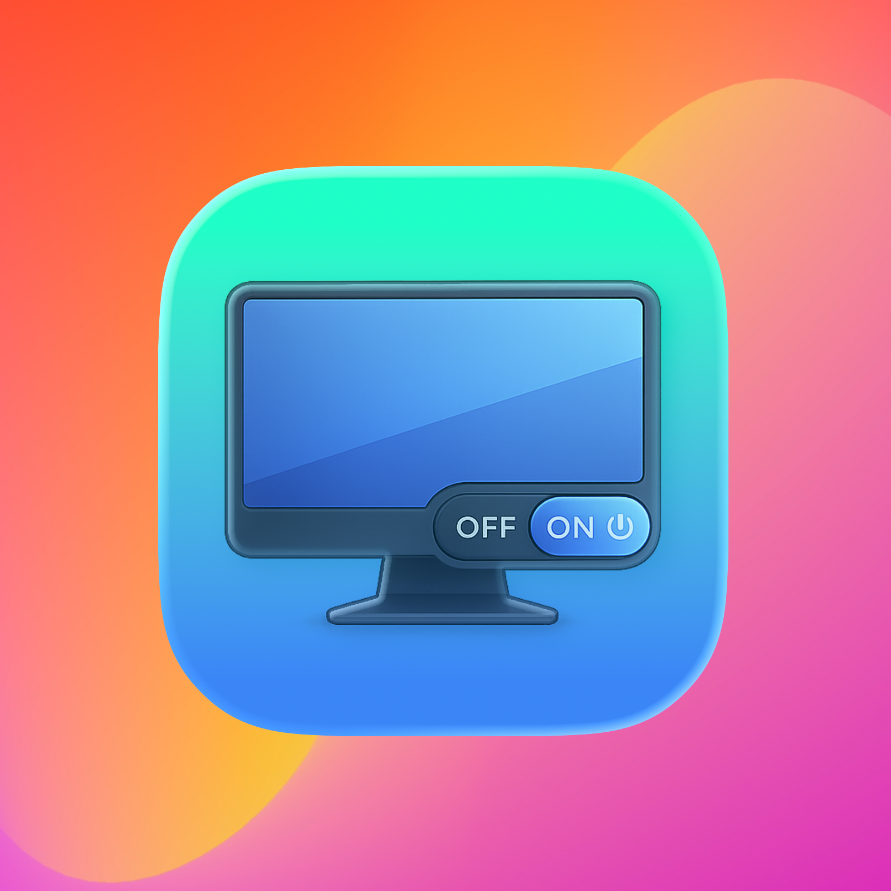
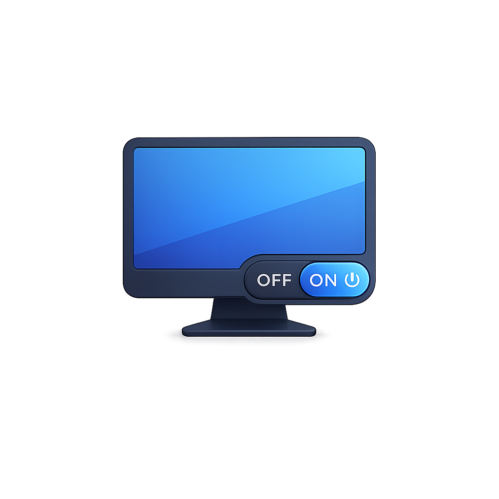

# Dimly

Dimly is the stealthy menu‑bar switch for external displays. One click (or a hotkey) drops glare instantly - blackout, sleep, or wake, per display or all at once. Keep the icon visible, or hide both the menu bar and Dock icons and let Dimly run quietly in the background.

  
  
  
  

    

  

  

    
🌍 Localizations (40)

    
<strong>Europe</strong>: 🇪🇸 Español · 🇮🇹 Italiano · 🇩🇪 Deutsch · 🇫🇷 Français · 🇵🇹 Português · 🇺🇦 Українська · 🇷🇺 Русский · 🇵🇱 Polski · 🇬🇷 Ελληνικά · 🇳🇱 Nederlands · 🇸🇪 Svenska · 🇨🇿 Čeština · 🇭🇺 Magyar · 🇫🇮 Suomi · 🇮🇪 Gaeilge · 🇦🇩 Català.

    
<strong>Asia</strong>: 🇵🇭 Filipino · 🇮🇳 हिन्दी · 🇮🇩 Bahasa Indonesia · 🇻🇳 Tiếng Việt · 🇹🇷 Türkçe · 🇨🇳 中文 · 🇯🇵 日本語 · 🇰🇷 한국어 · 🇹🇭 ภาษาไทย · 🇸🇦 العربية · 🇧🇩 বাংলা · 🇮🇷 فارسی · 🇲🇾 Bahasa Melayu · 🇲🇲 မြန်မာ · 🇮🇳 தமிழ் · 🇮🇳 తెలుగు · 🇵🇰 اردو.

    
<strong>Africa</strong>: 🇪🇹 አማርኛ · 🇳🇬 Hausa · 🇰🇪 Kiswahili · 🇳🇬 Yorùbá.

    
<strong>Americas</strong>: 🇧🇷 Português (Brasil) · 🇲🇽 Español (LatAm) · 🇺🇸 English.

  

  

    
Show screenshot

    
  

## Big hits

- **Instant blackout** - Smash glare on any external display with a full-screen overlay.
- **Sleep & wake** - Send DDC/CI standby and wake when supported, with seamless blackout fallback.
- **Per-display control** - Toggle, sleep, wake, rename, and copy IDs per screen from one menu.
- **Display labels** - Pop numbered overlays on every screen so you always know which is which.
- **Shortcut friendly** - Global hotkeys, including a fixed panic shortcut to restore everything.
- **State that sticks** - Remembers active blackouts and re-applies them after reconnects.
- **Profiles** - Save snapshots and auto-apply when external monitors appear.
- **Stealth mode** - Hide menu bar + Dock icons; Dimly keeps working for hotkeys.
- **Universal + updates** - Intel/Apple Silicon builds with Sparkle updates and a GitHub fallback.

## What it actually does (from the code)

- **Display inventory + change tracking** - live list of displays with connect/disconnect logging.
- **Blackout overlays** - per-display fullscreen overlays with fade transitions and persistence.
- **DDC/CI power control** - probe support, send standby/wake commands, and track status.
- **Sleep/wake fallback** - if DDC fails or is unsupported, blackout takes over instantly.
- **Hotkey system** - register custom hotkeys plus a fixed panic hotkey.
- **Display labels** - numeric overlays with friendly names for each screen.
- **Profiles + automation** - save/apply display snapshots, auto-apply on external connect.
- **Menu bar actions** - quick actions, per-display menus, rename display, copy display IDs.
- **Suspend All indicator** - button fills when all externals are suspended and shows a colored border for partial suspension.
- **Display ordering** - drag to reorder external displays in the menu list.
- **Diagnostics** - copy a display report and open a local diagnostics log.
- **Login + stealth** - launch at login, hide Dock icon, keep running when menu icon is hidden.
- **Updates + fallback** - Sparkle auto-updates with a GitHub download prompt on verify errors.

## How it works

1. Dimly sits in your menu bar. Click it or hit your hotkey.
2. Use **Toggle External Blackout** to mute glare on all externals, or target a single display in the list.
3. If your monitor supports DDC/CI, **Sleep** and **Wake** commands are sent directly; otherwise Dimly falls back to blackout.
4. Dimly tracks display changes, keeps blackout state consistent, and can show numbered overlays for quick identification.

## Keyboard & mouse

- **Show/hide Dimly window (works even when hidden):** default `Cmd` + `Ctrl` + `Option` + `M` (customizable).
- **Set your own toggle:** assign a hotkey for Toggle External Blackout / Sleep-Wake in Settings.
- **Option-click icon:** toggle blackout overlay on all externals.
- **Control-click icon:** toggle sleep/wake (with blackout fallback).
- **Restore everything:** fixed panic hotkey `Ctrl` + `Option` + `Shift` + `P`.
- **Per-display actions:** sleep, wake, blackout, rename, and copy IDs from each display row.
- **Close quickly:** press Esc or click away-the menu bar extra behaves like built-in menus.

## Quick tips

- Turn on **Show Display Numbers** when rearranging or labeling screens.
- Rename displays once so menus show friendly names instead of model strings.
- If DDC/CI is supported, prefer **Sleep** for true power-off; otherwise blackout is instant.
- Hide the menu bar icon if you want a stealth setup-hotkeys keep working.
- Use **Copy Display Report** or **Open Diagnostics Log** for fast support/debugging.

## Updates, signing, and safety

- Updates are delivered via Sparkle with ed25519 signatures; the feed lives in `Resources/Info.plist`.
- If signature verification fails, Dimly offers a GitHub download fallback.
- Notarization and hardened runtime are part of the release scripts; binaries ship notarized.
- No telemetry, no background daemons-Dimly runs only in the menu bar or at login.

## Get Dimly

- <a href="https://github.com/Punshnut/dimly/releases/latest">Download the latest release</a> and run it from `/Applications`.
- To auto-start, enable “Launch at Login” in Settings.

Supports Intel and Apple Silicon Macs. Requires macOS 14+

## Roadmap

- **Adaptive dimming** - remember per-location or time-of-day preferences.
- **Profile actions** - apply blackout/sleep rules when a saved setup is selected.
- **Per-app triggers** - auto-dim when select apps enter full screen.
- **Script hooks** - call custom scripts before/after blackout.

[Donate (Ko-Fi)](https://ko-fi.com/janfeuerbacher)

Made with ❤️

## Star History

